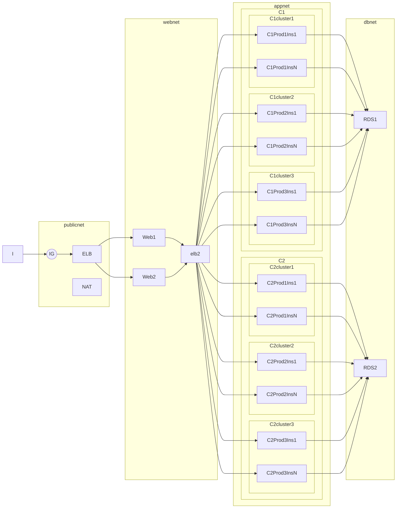

# Terramer: Terraform + Mermaid markup

Extend the [terraform graph](https://www.terraform.io/docs/commands/graph.html) command to generate mermaid diagrams.

# State

Very early code. A lot more ideas than code really.

Excuse golang noob-ness: this is my excuse to re-learn golang inspired by the masters: https://github.com/hashicorp/terraform/.

Currently using terraform as a library following this code: https://github.com/johandry/platformer/blob/master/platformer.go
As we get to learn the terraform code better, we may end-up with a different mechanism to get into the customize the graph output command.

# License

Same than Terraform: Mozilla Public License V2

# Sample diagram

Install the mermaid markdown preview plugin for VS Code to see the rendered diagram: https://github.com/mjbvz/vscode-markdown-mermaid

Source: https://github.com/knsv/mermaid/issues/161#issuecomment-104521770

